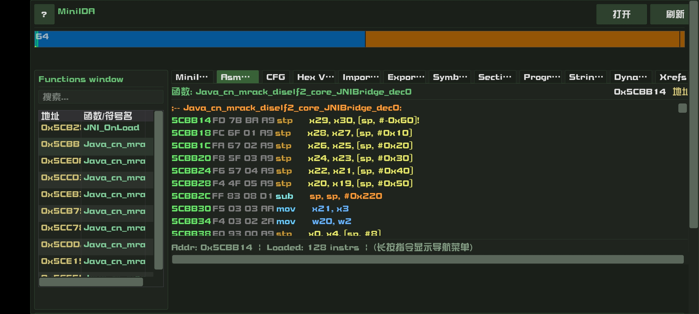
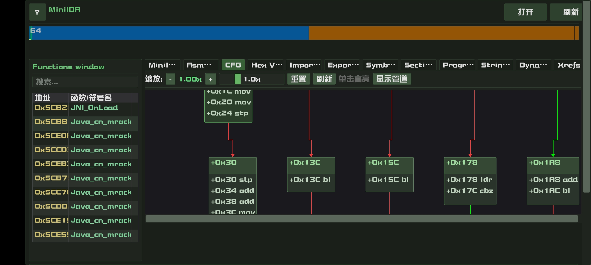
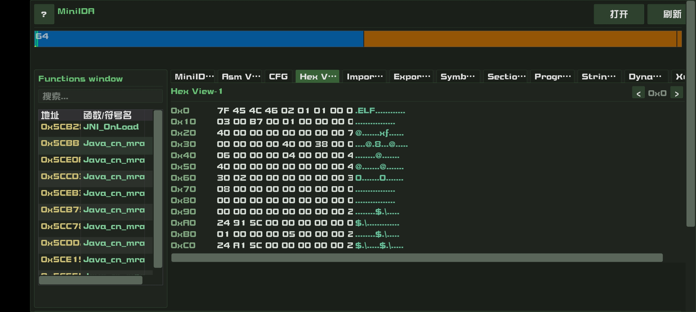
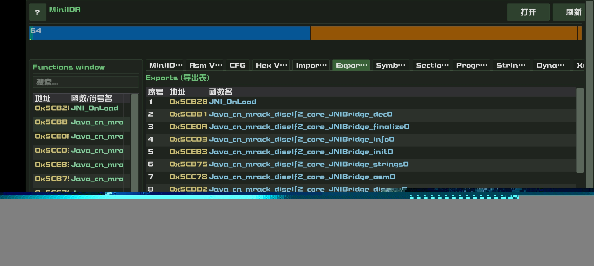

# MiniDA - Android 端 SO 逆向分析工具

Android 上的轻量级 SO 逆向工具，使用 ImGui 构建 UI，参考 IDA 布局，通过 Capstone 反汇编 + Keystone 汇编实现汇编视图与控制流图（CFG）展示。

## 功能

- ELF / SO 文件解析（32 / 64 位）
- 汇编指令反汇编（Capstone）
- 控制流图（CFG）可视化
- 导入 / 导出表、符号表、字符串、Hex 视图
- IDA 风格 UI，中文界面
- 多架构自动识别（ARM / ARM64 / x86 等）

## 截图

| 汇编视图 | CFG 控制流图 |
|:---:|:---:|
|  |  |

| Hex 视图 | 导出表 |
|:---:|:---:|
|  |  |

## 技术栈

ImGui + ImGui Android/OpenGL3 Backend · Capstone · Keystone · Android NDK · OpenGL ES 3.0

## 构建

```bash
# 配置 local.properties（sdk.dir / ndk.dir）
./gradlew assembleDebug
```

APK 输出路径：`app/build/outputs/apk/debug/`
